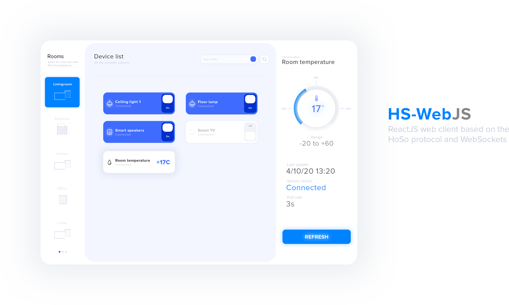
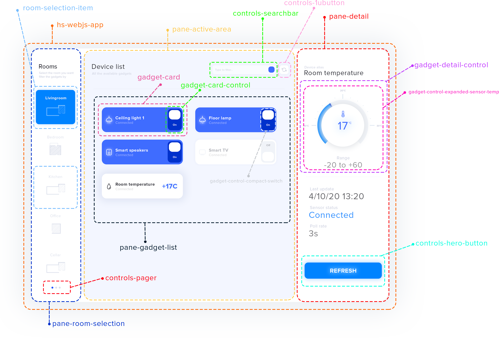
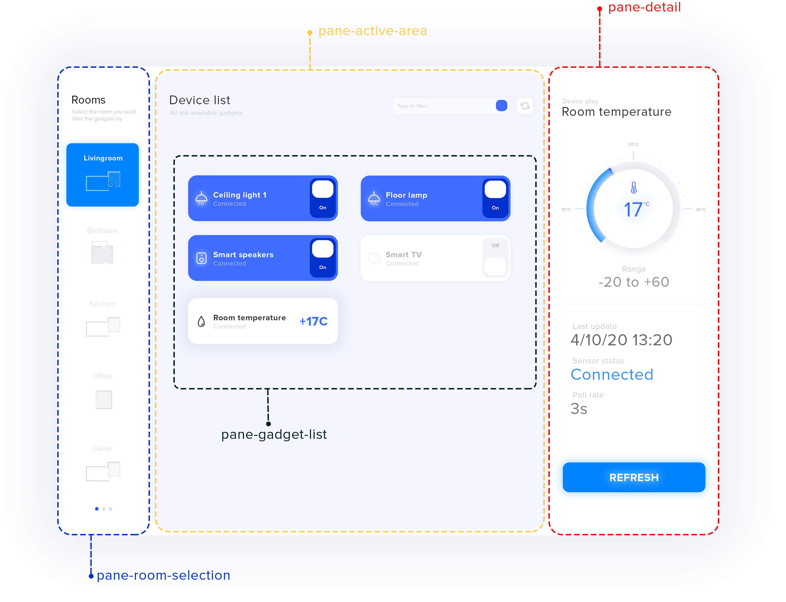
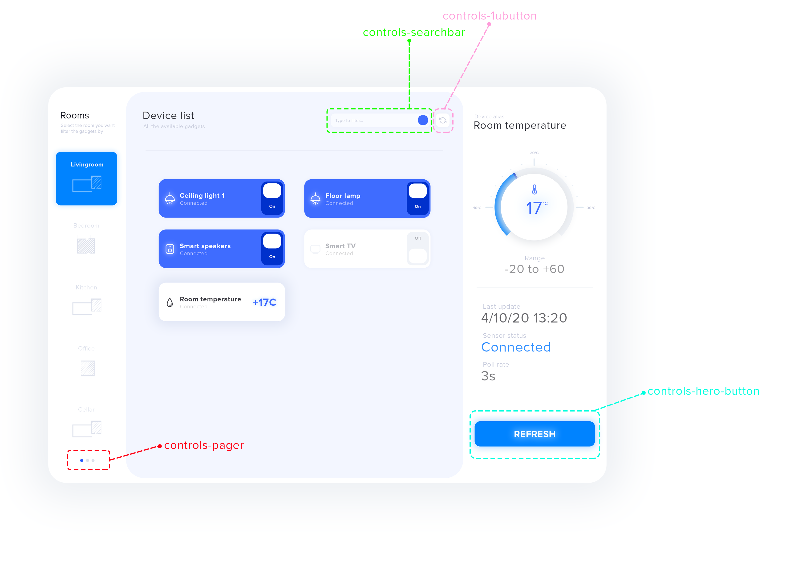

# HS-WebJS | Formally public-web-server <!-- omit in toc -->
> ReactJS Web-client based on the _**HoSo**_ protocol and _**WebSockets**_

    

## Table of contents <!-- omit in toc -->
- [Description](#description)
- [Design](#design)
  - [Framework and technologies](#framework-and-technologies)
  - [Component Structure](#component-structure)
    - [Overview](#overview)
    - [Panes |  `pane-*`](#panes--pane-)
    - [Controls |  `controls-*`](#controls--controls-)
    - [Gadget |  `gadget-*`](#gadget--gadget-)
      - [Gadget Cards |  `gadget-card-*`](#gadget-cards--gadget-card-)
      - [Gadget detail |  `gadget-detail-*`](#gadget-detail--gadget-detail-)
- [License](#license)

## Description

_HS-WebJS_, formally _public-web-server_, is a modern _Single Page Application (SPA)_ powered by _ReactJS_ and based on top of the _HoSo_ protocol and _WebSockets_. 

## Design

### Framework and technologies

Dictated by the system requirements and driven by the project leader constraints, the following set of frameworks, libraries and technologies has been found to be optimal. Please note that the highlighted version is the one being utilized for the following project; supplementary and alternative solutions that have been evaluated during the brifieng and design phase have also been added. 

1. **Front-end JS Framework:** **`ReactJS`**, VueJS 3,  Angular.js
2. **Continuous Delivery:** **`TravisCI `**, CircleCI
3. **Continuous Integration:** **`TravisCI `**, CircleCI
4. **Version control workflow:** **`Github flow `**, Git flow, Trunk based development
5. **Programming language:** **`Typescript (preferred)`**, Javascript
6. **Programming language version:** **`ECMAScript 2015 6+`**
7. **[OPTIONAL] Database:** **`MongoDB`**
8. **[OPTIONAL] Web server framework:** **`ExpressJS`**

### Component Structure

#### Overview

    

#### Panes |  `pane-*`
>Beside the root component, the application is built with four main wrapper components

The _SPA_ is built upon three main section/areas called __panes__ that, from left to right, define the main user interaction with the application. 

**Wrapper components:**
1. `pane-`selection-room
2. `pane-`active-area
3. `pane-`detail
4. `pane-`gadget-list

> note that all panes must contain the `pane-` prefix

    

#### Controls |  `controls-*`
>Custom general purpose controls have been designed and provided through the coreUI

The `controls-*` contains general purpose but custom designed elements to provide a richer user experience.

**Custom control:**
1. `controls-`searchbar
2. `controls-`1ubutton
3. `controls-`pager
4. `controls-`hero-button

    

> note that all controls shipped with coreUI must contain the `controls-` prefix

#### Gadget |  `gadget-*`
>Gadget related controls, wrappers and visualizer

The `gadget-*` contains all gadget's related controls, wrapper and visualizer.

**Gadget component wrappers:**
1. `gadget-`card
2. `gadget-`detail

##### Gadget Cards |  `gadget-card-*`
> Gadget cards represent an effortlessly quick-way to access, view and/or edit a sensor's state 

`Note: gadget-card-control is a component wrapper that holds the specific sensor's compact control `

##### Gadget detail |  `gadget-detail-*`
> Gadget detail contains the controls displayed in the detail pane - typically an expanded version of the compact control

`Note: gadget-detail-control is a component wrapper that holds the specific sensor's expanded control `

## License

[MIT](http://opensource.org/licenses/MIT)
